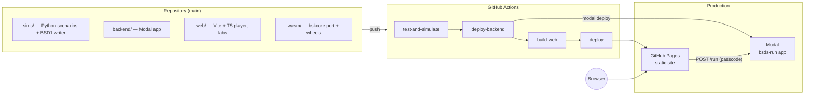
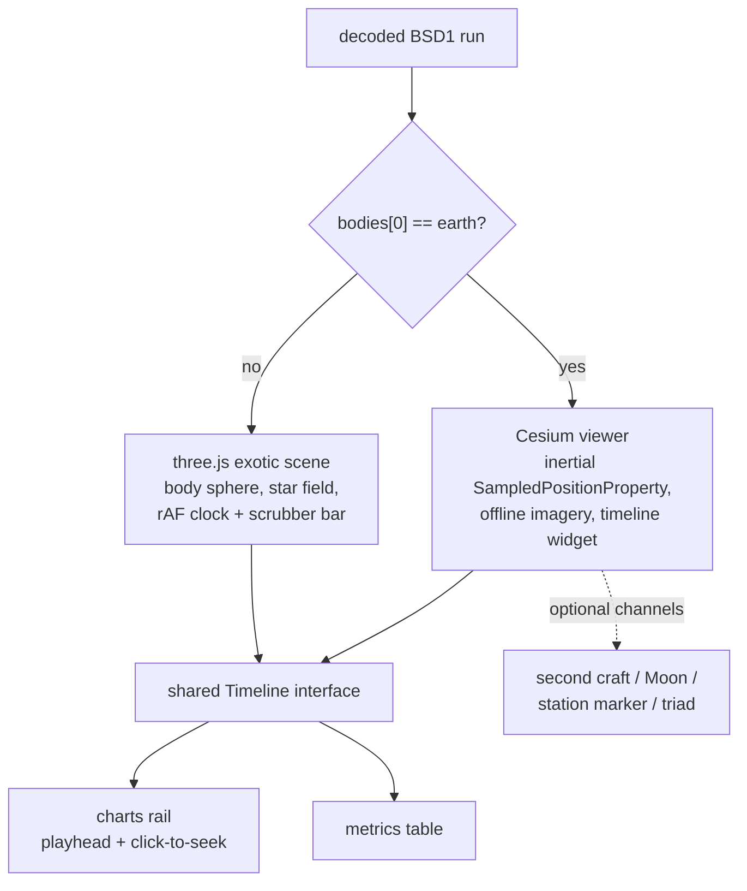
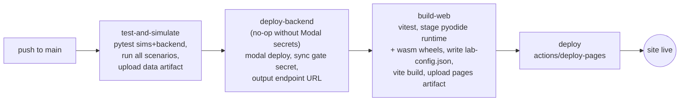
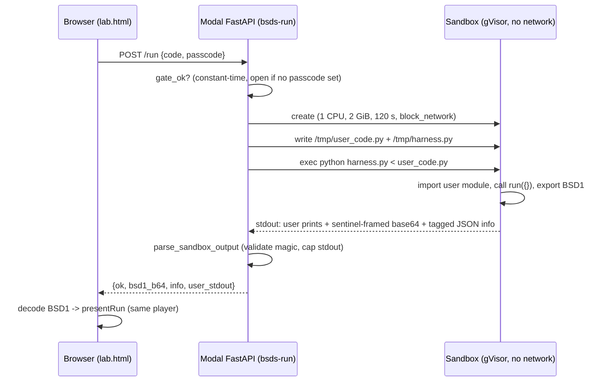
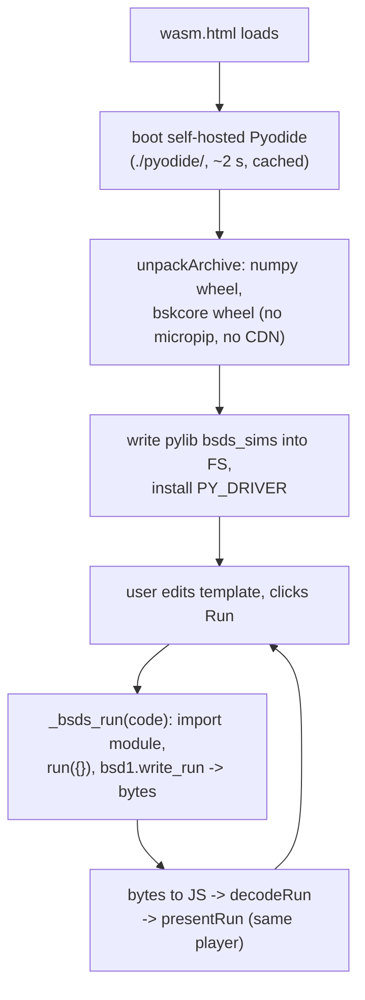

# BSDS Architecture

BSDS makes real spacecraft mission simulations — computed by
[Basilisk](https://avslab.github.io/basilisk/) (AVS Lab, CU Boulder) —
watchable, editable, and runnable from a web browser. This document explains
how the whole system fits together. (Design history and decision rationale
live in [`docs/superpowers/specs/`](docs/superpowers/specs/); this file
describes the system as built.)

The core idea: there are **three execution tiers** that all produce the same
artifact — a **BSD1 run file** — and one **presentation layer** that replays
any BSD1 file in 3D with synchronized telemetry. Everything else is plumbing
around that contract.

| Tier | Where Basilisk runs | Latency | Cost | Coverage |
|---|---|---|---|---|
| **Recorded missions** | GitHub Actions, at build time | pre-computed | $0 | full Basilisk |
| **Mission Lab** | Modal cloud sandbox, per request | seconds | $0 within free credits | full Basilisk |
| **WASM Lab** | the visitor's own browser (WebAssembly) | ~2 s after a one-time boot | $0 forever | the `bskcore` module subset |

## System overview



Every push to `main` re-runs the simulations, the full test suite, the site
build, and both deployments. There are no manual steps.

## Repository layout

```
BSDS/
├── sims/                 Python package `bsds_sims`
│   ├── bsds_sims/bsd1.py         BSD1 writer/reader (numpy)
│   ├── bsds_sims/recording.py    RunResult container + recorder helpers
│   ├── bsds_sims/scenarios/      the 8 mission modules + registry
│   ├── bsds_sims/build.py        CLI: run everything -> site data
│   └── tests/                    pytest (physics sanity + format round-trips)
├── backend/              Python package `bsds_backend` (Mission Lab)
│   ├── bsds_backend/core.py      gate, sandbox harness, output parser (pure)
│   ├── bsds_backend/app.py       Modal app: FastAPI endpoint + Sandbox orchestration
│   └── tests/                    pytest (incl. live subprocess harness round-trip)
├── web/                  Vite + TypeScript site
│   ├── index.html / player.html / lab.html / wasm.html
│   ├── src/                      bsd1.ts, present.ts, scene.ts, exotic.ts, charts.ts, ...
│   └── test/                     vitest (decoder vs Python fixtures, math, helpers)
├── wasm/                 Basilisk → WebAssembly port
│   ├── bskcore/generate.py       source-subset + patch + SWIG pipeline
│   ├── patches/                  sim_model no-threads patch, Python shims
│   ├── wheels/                   bskcore + numpy wasm wheels (committed)
│   └── scripts/, harness/, NOTES.md
├── notebooks/            Colab quickstart (free rail)
├── .devcontainer/        Codespaces workbench (free rail)
├── .github/workflows/    the single build-deploy pipeline
└── docs/superpowers/     design specs + implementation plans
```

## The BSD1 data contract

One binary file per simulation run. Both sides implement it independently and
are tested against shared fixtures (the Python writer produces a committed
fixture; the TypeScript decoder must reproduce it byte-for-byte).

```
bytes 0..7    magic "BSDS0001"
bytes 8..11   uint32 LE header length
next          UTF-8 JSON header (schema, scenario, epoch, params, n,
              bodies[], time info, channels[], metrics)
next          binary payload
```

- The payload starts with the time array (float64 LE, strictly increasing
  seconds), then each channel's columns stored **contiguously, column-major
  per channel** — so one component is a single zero-copy typed-array view in
  JavaScript.
- Channels are `f32` (hero runs) or quantized `i16` (sweep members):
  `offset = min`, `scale = (max − min) / 65534`,
  `stored = round((x − offset)/scale) − 32767`. Round-trip error ≤ scale/2.
- **Optional channels degrade gracefully**: readers ignore names they don't
  know, and every player feature keys off channel presence
  (`rw_speeds` → wheel chart, `r2_BN_N` → second spacecraft,
  `r_moon_N` → Moon, `separation`/`pointing_error` → extra charts) or off
  metrics (`station_lat_deg`/`station_lon_deg` → ground-station marker).
- `bodies[0]` names the central body; anything other than `earth` routes the
  player to the non-Earth renderer.

Producers: the CI build, the Mission Lab sandbox harness, and the WASM Lab's
in-browser driver — all through the same `bsds_sims.bsd1` writer. Consumer:
`web/src/bsd1.ts`.

## Simulation pipeline (`sims/`)

Each scenario is a module with a fixed contract: `ID`, `TITLE`,
`KIND ("single"|"sweep")`, `DESCRIPTION`, `DEFAULTS`, `EPOCH`, and
`run(params) -> RunResult` (time base, channel dict, bodies, metrics).
Sweep scenarios add `AXES` and `sweep_grid()`. The registry in
`scenarios/__init__.py` is the single list the build CLI iterates.

`python -m bsds_sims.build --out data` runs every registered scenario
(hero runs at full rate as f32; sweep members downsampled and quantized),
writing per-scenario `manifest.json` + `.bsd1` files, a site `index.json`,
the scenario sources as Mission Lab **templates**, and a pure-Python
`pylib/bsds_sims` bundle the WASM Lab imports at runtime.

The eight missions, with what makes each one honest physics:

| Scenario | Physics highlight |
|---|---|
| `basic_orbit` | point-mass Earth, RK4; period matches analytic to <2% test bound |
| `hohmann` | impulsive burns via velocity-state modification; Δv within 1% of analytic |
| `drag_deorbit` (4×4 sweep) | exponential atmosphere fitted to the 150–400 km band; chunked propagation to the 100 km interface |
| `attitude_detumble` | real FSW loop (inertial3D → attTrackingError → mrpFeedback → rwMotorTorque) on 3 HR16 wheels, torque/momentum margins checked |
| `ground_pointing` | locationPointing FSW; official example gains proved ZOH-unstable at 10 s steps and were retuned (documented) |
| `rendezvous` | two spacecraft in one sim; analytic phasing burns close 10.4 km → 285 m |
| `asteroid_arrival` | custom-gravity Bennu (μ=4.892 m³/s²); insertion from hyperbolic approach; period matches analytic to 0.002% |
| `halo_orbit` | true CR3BP: prescribed Moon (custom SpicePlanetState writer), differentially-corrected planar L2 Lyapunov orbit; Jacobi constant conserved to 2e-7 over 28 days |

None of the missions require SPICE ephemeris kernels — that keeps every tier
network-free at run time.

## The web player (`web/`)

Four pages share one presentation core:

- **index.html** — mission cards from `data/index.json` + the two lab cards.
- **player.html?scenario=…** — replays recorded runs; sweep scenarios get
  snapping sliders + a deorbit-time heatmap with nearest-run selection.
- **lab.html** — the Mission Lab (cloud execution).
- **wasm.html** — the WASM Lab (in-browser execution).

`presentRun(stage, run, els)` is the single entry point: it builds the clock,
the 3D scene, the chart rail, and the metrics table for any decoded run, and
picks the renderer per run:



Key mechanics, learned the hard way and now encoded in the code:

- **Timeline abstraction**: Cesium's clock and a `requestAnimationFrame`
  clock expose the same `{epoch, durationS, simSeconds, seekSeconds, onTick}`
  interface, so the chart rail works identically under both renderers.
- **CallbackProperty, never per-tick entity rebuilds**: replacing a
  polyline's positions with a new `ConstantProperty` every frame keeps
  Cesium's DataSourceDisplay permanently un-ready, which silently freezes the
  Viewer clock (`canAnimate=false`). Dynamic geometry (attitude triad,
  station link) uses `CallbackProperty`.
- **Explicit `SYSTEM_CLOCK_MULTIPLIER`**: without it the clock advances at
  wall speed regardless of the multiplier.
- **Charts follow the dataviz method**: a colorblind-validated categorical
  palette (checked programmatically against the panel surface), single-series
  charts carry no legend, multi-series charts get legend + direct end-labels,
  and text never wears series color.

## Tier 1: recorded missions (CI)



Notes that save future debugging:

- `deploy-backend` reads the three repo secrets (`MODAL_TOKEN_ID`,
  `MODAL_TOKEN_SECRET`, `BSDS_RUN_PASSCODE`). Absent secrets → every step
  no-ops and `build-web` writes `{"endpoint": null}` so the Mission Lab
  renders in "editing only" mode. Deleting just the passcode secret makes the
  lab public (the gate reads an empty value as open).
- The Modal deploy runs in **module mode** (`modal deploy -m bsds_backend.app`)
  because the app uses package-relative imports.
- The deploy job intentionally carries **no `environment:` declaration**: the
  auto-created `github-pages` environment kept a deployment-branch policy
  naming the pre-rename default branch and rejected jobs before they started.
  The workflow comment explains how to restore it if the policy is fixed.
- The WASM runtime is **self-hosted**: `build-web` installs `pyodide@0.29.4`
  from npm and copies its dist plus the committed wheels into the site, so
  the WASM Lab makes zero third-party requests in production.

## Tier 2: Mission Lab (cloud execution)

Arbitrary scenario code runs in an isolated per-request sandbox. The user
code contract is the same as the scenario modules: define
`run(params) -> RunResult` (which is why the lab's templates are literally
the mission source files).



Security posture: user code never string-interpolates into anything (it
travels as a file/stdin); the sandbox image is fixed (`bsk==2.11.1` + the
repo's `sims/` package baked at deploy time); the sandbox has no network and
hard CPU/memory/wall caps; the web endpoint only relays parsed results. The
harness protocol (sentinel-framed payload + one tagged JSON info line) is
unit-tested end-to-end via a real subprocess in `backend/tests`.

## Tier 3: WASM Lab (in-browser execution)

The heart of the project: a subset of Basilisk v2.11.1 cross-compiled to
`wasm32-emscripten` and packaged as a Pyodide wheel (`bskcore`, ~1.8 MB,
21+ SWIG extension modules). Validated trajectories match native Basilisk to
~1e-15 relative error — machine precision — on both the basic orbit and the
multi-burn Hohmann transfer.

How the port works (full log in [`wasm/NOTES.md`](wasm/NOTES.md)):

- `wasm/bskcore/generate.py` copies a pinned source subset out of the
  Basilisk v2.11.1 tree, applies patches, runs the repo's own
  libclang-based message-payload generators, then host SWIG; `setup.py`
  builds the wheel with `pyodide build` (no Conan anywhere).
- The one mandatory source change: Basilisk's sim executive unconditionally
  spawns a `std::thread` even for single-threaded runs, and Pyodide forbids
  pthreads. `patches/sim_model_nothreads.patch` drives the process list
  inline under `__EMSCRIPTEN__`; the numerical stepping code is untouched,
  which is why results agree at machine precision.
- Excluded by design: ZeroMQ/Vizard streaming, multiprocessing Monte Carlo,
  SPICE (so far), and the C FSW algorithm stack. The wheel grows
  module-by-module as scenarios need them.



The template picker only offers scenarios whose full dependency closure
exists in the wheel (`WASM_TEMPLATE_IDS` in `web/src/wasmcore.ts`).

## Testing strategy

Every layer tests the thing the next layer depends on (counts as of
2026-08-18: 45 sims + 9 backend + 54 web = 108):

- **Format**: Python round-trips (f32 exact, i16 within scale/2); the TS
  decoder decodes a committed Python-written fixture byte-for-byte.
- **Physics**: each scenario asserts against analytic truths (periods, Δv,
  bounded radii, Jacobi-adjacent invariants) — not against golden files.
- **Backend**: the sandbox harness runs for real in a subprocess in CI.
- **WASM**: dual-environment validation scripts run identical scenarios
  native and in Pyodide and diff trajectories (~1e-15).
- **Visual**: every player feature lands with headless-Chromium screenshots
  and zero-console-error checks; risky refactors carry pixel-regression
  proofs (the renderer split changed 0 of 1.3 M pixels on the baseline page).
- **CI is the integration test**: a failure anywhere blocks deploy.

## Cross-cutting constraints

- **$0 hosting invariant**: everything user-facing is static files on GitHub
  Pages; the only server (Modal) scales to zero and sits inside free credits.
  No API keys or third-party requests exist in the shipped site.
- **Attribution**: BSDS is powered by Basilisk (ISC License, AVS Lab / CU
  Boulder) and says so on every page; the project is independent and the
  name avoids implying endorsement.
- **Forward compatibility**: unknown BSD1 header keys, channels, and dtypes
  are ignored, so newer producers don't break older players and vice versa.

## In flight / next

- Share & upload for both labs: compressed share-links in the URL fragment,
  `?src=`/`?gist=` loading, `.py` upload, friendly unsupported-module errors.
- Wheel growth (drag modules landing; SPICE and FSW stack are the big-ticket
  items), a community mission gallery via validated pull requests, and
  upstreaming the no-threads patch to the AVS Lab.
